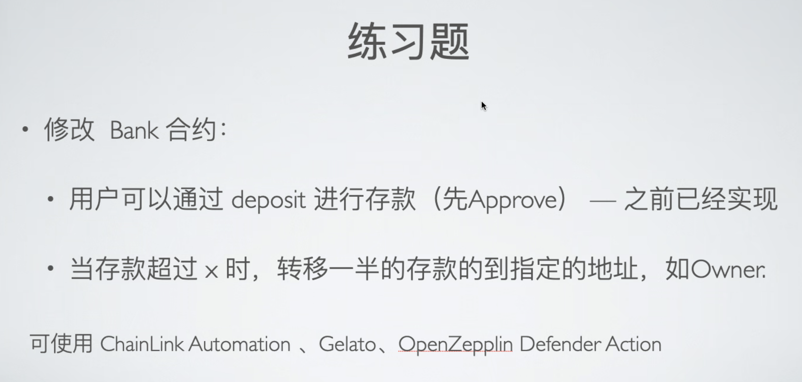

# 练习题（02.23）

## 1. 合约信息与 EOA 信息

- 向 **Bank 合约**内转入 token 的**EOA 地址**：0xe41adB48ad52560CDc3116F8283832c1749183B1

- **Bank 合约**的`owner`地址：0x9314f15a04d9a69bCE94758e535e49c4e6c6770E

- **Bank 合约**（合约名 *SuperBank* ）**地址**：https://mumbai.polygonscan.com/address/0xd7Ec5F0aD69CFc6E6152e255CE55A12FA316Ac28

- **ERC-20 合约**（合约名 *ERC777Token_GTST* ）**地址**：https://mumbai.polygonscan.com/address/0x119c67F0B8D7bA6DB5D4f427aB872b0ABEC30529

- **Upkeep合约**（合约名`AutoWithdraw`）**地址**：https://mumbai.polygonscan.com/address/0xB64Bfe72f550831c4595bDDB95db61EA6f58E625

部署时设定 Upkeep 合约<u>自动转账的余额阈值</u> 为 `100 * 10 ** 18`，转账目标地址为`owner`。

## 2. 交易信息

- 第一步：**EOA** 授权 **Bank 合约**一定大于<u>自动转账的余额阈值</u> 的 ERC-20 Token（以下称 **GTST**），并向其中转入 **99.999999999999999999** **GTST**（未达到转账的余额要求，即 **100 GTST**）。
  - **交易信息**：https://mumbai.polygonscan.com/tx/0xf90ba8cc6a240b74d662d20dfb297a8d575bb5fb7282e23303b5a0bc5ed043b0
  - 交易结束后，**Upkeep 合约**未触发 **{performUpkeep}** 方法，符合预期。
- 第二步：**EOA** 再次向**Bank 合约**转入 **0.000000000000000001 GTST**（与第一步中转入的 token 数量刚好达到<u>自动转账的余额阈值</u>）。
  - **交易信息**：https://mumbai.polygonscan.com/tx/0xcee03134381c3fa34c0d63129a59efb26073962ebb16b3d7a05d6db22e7a050d
  - 交易结束后，**Upkeep 合约**触发了 **{performUpkeep}** 方法，其向`owner`转入了 **50 GTST**（即余额的一半），符合预期。
  - **Upkeep 合约**触发自动执行的**交易信息**：https://mumbai.polygonscan.com/tx/0xbd268c712bb455ac00ba112ba3179b969cd81984430a886e52a2f1c914e458ed

综上，自动执行合约调用成功！
